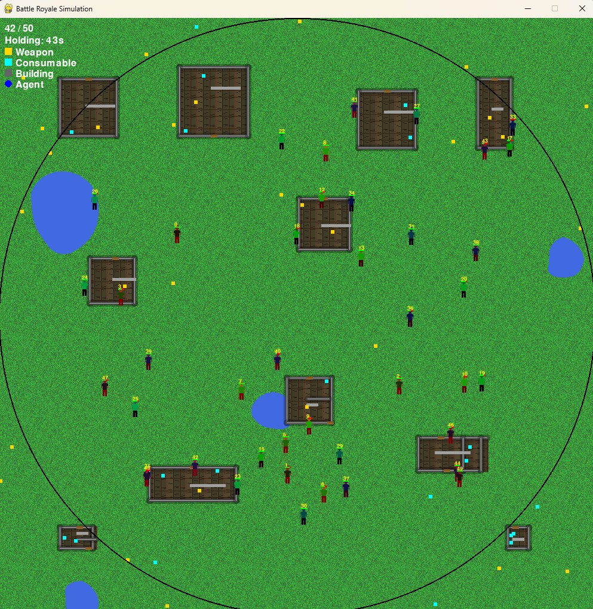

# PyRoyaleArena



A lightweight Battle-Royale–style simulation built with Pygame. Agents roam a procedurally generated arena, pick up loot, and fight to be the last one standing while the playable “safe zone” (the Storm) shrinks over time.

---

## 🚀 Features

- **Autonomous Agents**  
  Each agent has its own **skill** and **luck** parameters, driving decisions for movement, shooting, looting and evasion.

- **Storm / Safe Zone**  
  A circular safe area shrinks in configurable phases. Outside the storm, agents take damage and are forced to converge.

- **Procedural Terrain**  
  - **Grass, Rocks & Trees** are scattered at startup via `config/map.yaml`.  
  - Obstacles block both movement and line-of-sight.  
  - Counts are adjustable (`tree_count`, `rock_count`, `grass_count`).

- **Buildings & Water**  
  - Walls, interiors and doors defined in `config/buildings.yaml`.  
  - Organic ponds generated procedurally.

- **Loot Spawning**  
  - Initial loot and periodic spawns inside the safe zone.  
  - Configurable loot types & probabilities in `config/loot_table.yaml`.

- **Agent Inspector**  
  Click on any agent to view real-time stats (health, shield, skill, inventory, last action).

- **Dynamic Storm Overlay**  
  Areas outside the safe circle are softly greyed out with a transparent overlay, focusing attention on the playable zone.

---

## 📦 Installation

1. **Clone the repository**  
   ```bash
   git clone https://github.com/ashvernon/PyRoyaleArena.git
   cd PyRoyaleArena
   
2. **Create & activate a virtualenv**  
   ```bash
    python3 -m venv venv
    # macOS/Linux
    source venv/bin/activate
    # Windows
    venv\Scripts\activate
    ```
3. **Install dependencies**
  ```bash
  pip install -r requirements.txt
  ```

▶️ Usage

4. **Run the main script:**
  ```bash
  python run_simulation.py
  ```
Left-click an agent to inspect its stats.

Watch the storm circle shrink—stay inside to survive!

Last agent standing wins.

⚙️ Configuration
All parameters live under the config/ directory:

map.yaml
width: 800
height: 600
tree_count: 50
rock_count: 30
grass_count: 100
buildings:

# imported from buildings.yaml
buildings.yaml – Defines wall segments, interiors and doors.

storm.yaml – Storm phases (hold & shrink durations).

loot_table.yaml – Loot spawn probabilities & types.

agents.yaml – Number of agents, skill & luck ranges.

Adjust these values to tweak map size, obstacle density, storm timing, loot frequency, and AI behavior.

🧠 Design & Rationale
Why Pygame?
Simple, zero-boilerplate 2D engine perfect for rapid prototyping and teaching core game loops.

Why Procedural?
Easily test different map layouts and obstacle densities without hand-crafting levels.

Why Clickable Inspector?
Provides insight into agent decision-making for debugging AI behaviors and tuning parameters.

🤝 Contributing
Fork the repo

Create a feature branch (git checkout -b feature/YourFeature)

Commit your changes (git commit -m "Add feature")

Push to your fork (git push origin feature/YourFeature)

Open a Pull Request

Please update tests and documentation as needed.

📜 License
This project is released under the MIT License.

Enjoy simulating your own mini battle royale! 🎮
